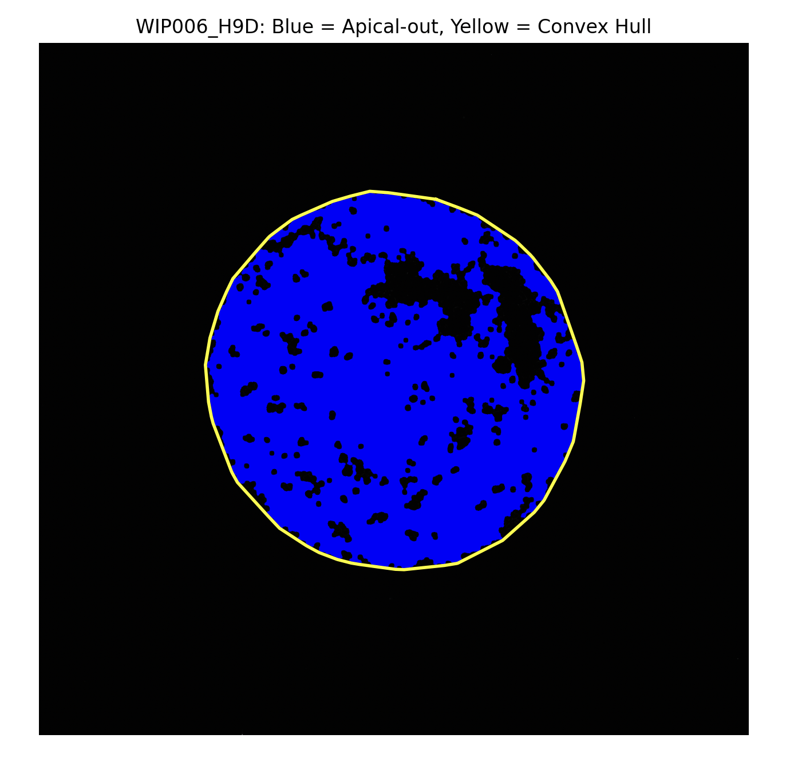

<h1 align="center">
  🎀 Neuroepithelial-Organoid-Analysis-Pipeline 🎀<br>
  <sub>A Bioinformatics Project for Image Analysis</sub>
</h1>

<p align="center">
  
  
  
</p>

---

## 🌸 Overview

This bioinformatics pipeline is designed to analyze **neuroepithelial organoids** and classify cells as **Apical-in** or **Apical-out** based on ZO1-EGFP fluorescence intensity. The goal is to generate quantitative data on cell polarity configurations to support biological research.

By studying **apical membrane formation** and **epithelial cell polarity**, we can gain insights into the mechanisms that regulate neuroepithelial development! 🧠🔬

---
## 💁🏻‍♀️Tutorial

For a comprehensive guide on how to use this repository, please refer to the [Tutorial](./tutorials.ipynb) fil
See the [Happy Path Demo](./tutorials/happy_path_demo.ipynb) notebook for a full example run of the pipeline.


## 🎯 Research Goal

🧬 **Biological Question:**
> How do apical membrane formation and epithelial polarity emerge in neuroepithelial organoids?

📜 **Project Description:**
This project develops an image analysis pipeline that quantitatively classifies neuroepithelial organoid cells into **Apical-in** or **Apical-out** categories based on fluorescence intensity distribution.

📸 **Input Data:**
- TIFF images of neuroepithelial organoids stained for ZO1-EGFP

📊 **Output Data:**
- **CSV File:** Quantitative classification of cells (Apical-in/Apical-out)
- **Overlay Image:** Color-coded cell classifications (🔵 Blue = Apical-out, 🔴 Red = Apical-in, 🟡 Yellow = Convex Hull Area)

---

## 🛠️ Project Structure
📂 **Project Files:**
```
📄 image_processing.py # Handles image loading and preprocessing
📄 segmentation.py # Performs segmentation and labeling
📄 classification.py # Classifies cells into Apical-in/Apical-out
📄 utils.py # Utility functions for saving files and computing stats
📄 main.py # The main script to run everything
📄 apical_out_counter.py # Function to count only Apical-out cells
📄 requirements.txt # List of dependencies
📄 README.md # Project Documentation
📄 cell_classification_results.csv # Output file
📄 cell_classification_overlay.tif # Output image
```
---

## 🔧 Installation & Usage

💻 **Set up your environment:**
```sh
# Clone the repository
$ git clone https://github.com/MaggieCoder/Neuroepithelial-Organoid-Analysis-Pipeline.git
$ cd Neuroepithelial-Organoid-Analysis-Pipeline

# Install dependencies
$ pip install -r requirements.txt

# Run the pipeline
$ python main.py --image /path/to/your/image.tif
```

---

## 📌 Pipeline Workflow

1️⃣ **Preprocess Image** 📷
   - Convert to grayscale
   - Apply Otsu thresholding to create a binary mask
   - Remove small objects & fill holes

2️⃣ **Segment Cells** 🔍
   - Label individual cells
   - Extract region properties

### **Feature 1: Classify Cells** 🎨
   - Compute distance transform
   - Measure ZO1 fluorescence intensity
   - Apply classification rules (Apical-in / Apical-out)
   - **Output:** Cells classified as Apical-in (🔴 Red) or Apical-out (🔵 Blue)

### **Feature 2: Count Apical-out Cells** 🔢
   - Use `apical_out_counter.py` to count only Apical-out cells
   - **Output:** Only Apical-out cells are counted (🔵 Blue)

3️⃣ **Convex Hull Calculation** 🟡
   - Calculate the Convex Hull Area to obtain more accurate counts
   - Overlay Convex Hull Area with a yellow line

4️⃣ **Generate Outputs** 📊
   - Save **CSV file** with cell measurements
   - Save **Overlay Image** for visualization

---

## 💖 Visualization
Feature 1: Classify Cells 

**Legend:**
- 🔵 **Blue** = Apical-out
- 🔴 **Red** = Apical-in
- 🟡 **Yellow** = Convex Hull Area

---
Feature 2: Count Apical-out Cells

<div style="text-align: left;">
  
</div>

**Legend:**
- 🔵 **Blue** = Apical-out
- 🟡 **Yellow** = Convex Hull Area

## 🧬 How to Interpret Results

When analyzing the results, the **distance ratio** calculated for each cell helps determine its classification:
- **High Distance Ratio (Apical-in):** Indicates that the cell's apical membrane is more centrally located, suggesting strong epithelial polarity.
- **Low Distance Ratio (Apical-out):** Indicates that the cell's apical membrane is positioned peripherally, suggesting weaker epithelial polarity.

---
### 📊 Cell Classification Results

#### 🧪 Individual Cell Data

| Image Title   | Cell ID | Min Cell Area | Threshold | Total Area | Classification | 
|---------------|---------|----------------|-----------|-------------|------------------|
| Sample_A      | 1       | 100            | 207584    | Apical-out  | 0.268858528452381 |
| Sample_A      | 2       | 100            | 2852      | Apical-out  | 0.364660368247605 |
| Sample_A      | 3       | 100            | 112512    | Apical-out  | 0.234049440608914 |
| Sample_A      | 4       | 100            | 1258      | Apical-out  | 0.389198650290905 |
| Sample_A      | 5       | 50             | 459536    | Apical-out  | 0.169432771153117 |
| Sample_A      | 6       | 50             | 2169      | Apical-out  | 0.111597061398164 |
| Sample_A      | 7       | 50             | 1848      | Apical-out  | 0.354685169924484 |
| Sample_A      | 8       | 50             | 2920      | Apical-out  | 0.301976520709842 |
| Sample_A      | 9       | 30             | 556196    | Apical-out  | 0.157386214431226 |
| Sample_A      | 10      | 30             | 661       | Apical-out  | 0.367607311046904 |

#### 🔗 Convex Hull Analysis

| Image Title   | Union Cell Area | Convex Hull Area | Area Ratio (Union / Hull) |
|---------------|------------------|-------------------|----------------------------|
| Sample_A      | 556857           | 866297            | 0.642801487249754          |

---

## 📌 Dependencies

- Python 3.8+
- NumPy
- SciPy
- Scikit-Image
- Pandas
- Matplotlib

To install them manually:
```sh
pip install numpy scipy scikit-image pandas matplotlib
```
```

## 📖 How to Cite This Project

If you use this code or pipeline in your research, please cite the following:

```bibtex
@misc{feng2025organoid,
  author       = {Geshan,Feng},
  title        = {Neuroepithelial Organoid Analysis Pipeline},
  year         = {2025},
  publisher    = {GitHub},
  journal      = {GitHub repository},
  url          = {https://github.com/MaggieCoder/Neuroepithelial-Organoid-Analysis-Pipeline}
}
```
## 👩‍💻 Contact / Authors
**Project Lead**: Geshan Feng  
**Affiliation**: University of Michigan – Ann Arbor  
**Department**: Tidball Lab - Michigan Neuroscience Institute Affiliate  
**Email**: geshan@umich.edu  
**GitHub**: [@MaggieCoder](https://github.com/MaggieCoder)

We welcome feedback and contributions!  
Please open an [issue](https://github.com/MaggieCoder/Neuroepithelial-Organoid-Analysis-Pipeline/issues) or submit a [pull request](https://github.com/MaggieCoder/Neuroepithelial-Organoid-Analysis-Pipeline/pulls) for improvements.

