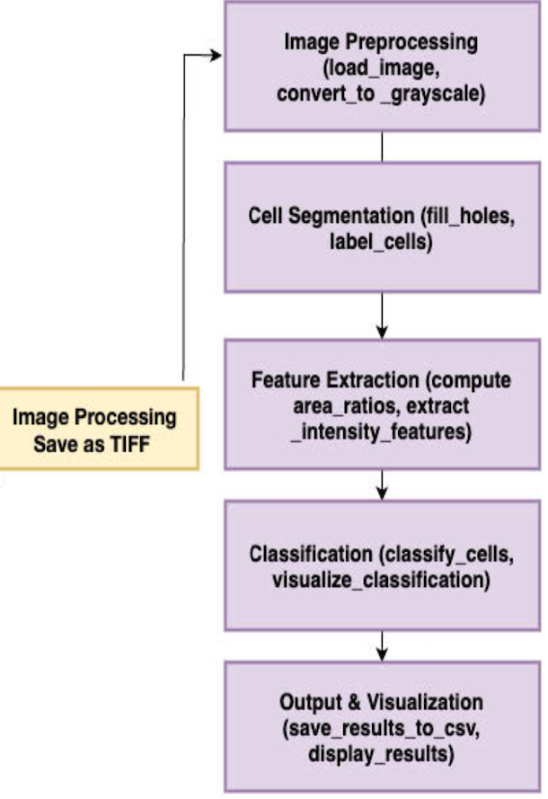
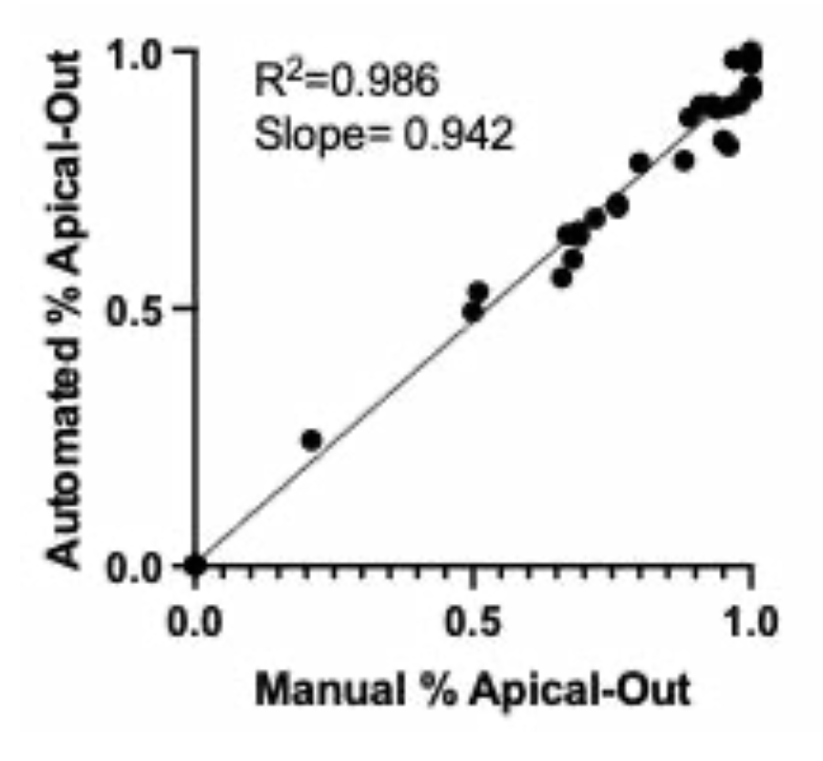

# Summary

Neuroepithelial-Organoid-Analysis-Pipeline is a Python-based software package that automatically classifies neuroepithelial organoid cells as *apical-in* or *apical-out* from fluorescence microscopy images. Apicobasal polarization is a key structural feature of epithelial tissues, and quantifying this organization is essential for understanding neurodevelopment and disease. Manual scoring is labor-intensive and subjective, while existing semi-automated approaches often require dataset-specific tuning. This open-source pipeline provides a reproducible, high-throughput, and fully automated solution for polarity quantification in neuroepithelial organoids.

# Statement of Need

The spatial organization of apical surfaces in neuroepithelial organoids determines key developmental processes such as progenitor proliferation, lumen formation, and epithelial morphogenesis. However, there is currently no open-source, fully automated tool to distinguish *apical-out* from *apical-in* configurations across large imaging datasets. Traditional approaches, such as ImageJ/Fiji macros or Ilastik-based machine learning workflows, rely on manual segmentation or parameter tuning for each dataset, limiting reproducibility and throughput.

Our software addresses this gap by combining adaptive thresholding, morphological filtering, and convex-hull–based spatial analysis to classify cell polarity automatically. The pipeline eliminates user bias, supports batch processing of hundreds of images, and outputs both annotated visualizations and quantitative Excel summaries. This tool thus enables standardized polarity quantification across experiments, promoting reproducibility in developmental biology research.

# Software Description

The pipeline is implemented in **Python (v3.8+)**, using open-source libraries including OpenCV, scikit-image, NumPy, pandas, and tqdm.  

**Main modules:**
- `main.py`: command-line interface and configuration loading  
- `image_preprocessor.py`: noise reduction and contrast enhancement (Gaussian blur, CLAHE)  
- `segmenter.py`: adaptive thresholding (Otsu) and morphological operations  
- `analyzer.py`: polarity quantification using distance-transform–based indices  
- `exporter.py`: generation of annotated PNGs and Excel summary files  

**Input and Output:**
- **Input:** A directory of raw fluorescence microscopy images  
- **Output:**  
  - Annotated PNG images with colored contours (*blue = apical-out, red = apical-in, yellow = convex hull*)  
  - Excel file summarizing per-cell and per-organoid metrics (cell count, area, convex hull area, polarity ratio, compactness)

*Figure 1. Overview of the Neuroepithelial Organoid Analysis Pipeline, illustrating preprocessing, segmentation, classification, and result export.*

# Validation and Performance

To evaluate accuracy, automated polarity ratios were compared against expert manual annotations (Dr. Andrew Tidball) for 37 organoid images.  
The results demonstrated a **Pearson correlation of r = 0.98** and a **mean absolute error (MAE) of 0.04**, indicating excellent agreement between automated and manual quantification.

Processing time averaged **~12 seconds per image** in batch mode, with <2% failure rate.  
These findings confirm that the pipeline provides reliable, high-throughput polarity quantification suitable for large-scale organoid imaging studies.

*Figure 2. Correlation between automated and manual apical polarity ratios across 37 organoid images.*

# Acknowledgements

The author thanks **Dr. Andrew Tidball** (University of Michigan) for providing annotated validation datasets, conceptual guidance, and laboratory resources.  

# References

Berg, S., Kutra, D., Kroeger, T., Straehle, C. N., Kausler, B. X., Haubold, C., ... & Kreshuk, A. (2019). ilastik: Interactive machine learning for (bio)image analysis. *Nature Methods, 16*(12), 1226–1232. https://doi.org/10.1038/s41592-019-0582-9  

Carpenter, A. E., Jones, T. R., Lamprecht, M. R., Clarke, C., Kang, I. H., Friman, O., ... & Sabatini, D. M. (2006). CellProfiler: Image analysis software for identifying and quantifying cell phenotypes. *Genome Biology, 7*(10), R100. https://doi.org/10.1186/gb-2006-7-10-r100  

Lancaster, M. A., Renner, M., Martin, C. A., Wenzel, D., Bicknell, L. S., Hurles, M. E., ... & Knoblich, J. A. (2013). Cerebral organoids model human brain development and microcephaly. *Nature, 501*(7467), 373–379. https://doi.org/10.1038/nature12517  

McQuin, C., Goodman, A., Chernyshev, V., Kamentsky, L., Cimini, B. A., Karhohs, K. W., ... & Carpenter, A. E. (2018). CellProfiler 3.0: Next-generation image processing for biology. *PLoS Biology, 16*(7), e2005970. https://doi.org/10.1371/journal.pbio.2005970  

Paşca, A. M., Sloan, S. A., Clarke, L. E., Tian, Y., Makinson, C. D., Huber, N., ... & Paşca, S. P. (2015). Functional cortical neurons and astrocytes from human pluripotent stem cells in 3D culture. *Nature Methods, 12*(7), 671–678. https://doi.org/10.1038/nmeth.3415  

Schindelin, J., Arganda-Carreras, I., Frise, E., Kaynig, V., Longair, M., Pietzsch, T., ... & Cardona, A. (2012). Fiji: an open-source platform for biological-image analysis. *Nature Methods, 9*(7), 676–682. https://doi.org/10.1038/nmeth.2019  

Taverna, E., Götz, M., & Huttner, W. B. (2014). The cell biology of neurogenesis: toward an understanding of the development and evolution of the neocortex. *Annual Review of Cell and Developmental Biology, 30*, 465–502. https://doi.org/10.1146/annurev-cellbio-101011-155801  
